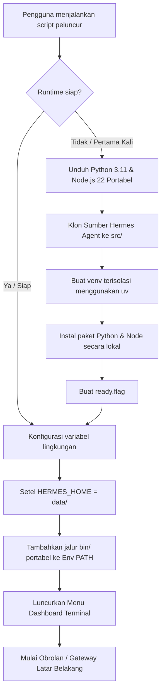

# <p align="center">🛸 SRPCOM HERMES PORTABLE — Portabel & Lintas-Platform</p>

<p align="center">
  <a href="https://tuban.store" target="_blank">
    
  </a>
</p>

<p align="center">
  <a href="./README.md">English</a> | <strong>Bahasa Indonesia</strong>
</p>

<p align="center">
  
  
  
</p>

---

<p align="center">
  <strong>Jalankan agen AI yang sepenuhnya mandiri dan dapat meningkatkan kemampuannya sendiri dari satu folder atau drive USB.</strong><br>
  Tanpa instalasi global. Bebas polusi pada sistem host. Semua percakapan, konfigurasi, memori, dan keahlian (skills) tetap tersimpan di dalam folder Anda.
</p>

---

## ✨ Fitur Utama

*    **Tanpa Ketergantungan pada Host**: Tidak memerlukan instalasi Python, Node.js, atau manajer paket secara global di komputer Anda. Semua lingkungan eksekusi (runtimes) diunduh secara lokal.
*    **100% Portabel**: Salin seluruh direktori ke flash drive USB atau SSD eksternal. Jalankan di komputer Windows, macOS, atau Linux apa pun secara instan.
*    **Privasi & Isolasi Sejati**: Kunci API Anda (`data/.env`), percakapan (`data/sessions/`), memori persisten, dan keterampilan khusus disimpan sepenuhnya di dalam folder portabel Anda.
*    **Peluncur Konsol Interaktif**: Menyediakan terminal UI dashboard yang indah dengan pelacakan status setup, penyedia LLM, dan background gateway.
*    **Kemampuan Penuh Hermes**: Mempertahankan semua fitur dari [Nous Research's Hermes Agent](https://github.com/NousResearch/hermes-agent), termasuk penyimpanan memori dan pembuatan keahlian yang dapat digunakan kembali.

---

## ⚡ Memulai Cepat

Jalankan SRPCOM HERMES PORTABLE dalam hitungan detik tergantung pada sistem operasi Anda:

### Windows (10 / 11)
Cukup klik dua kali berkas **`SRPCOMHERMES.bat`** di folder ini.
> *Catatan: Pada peluncuran pertama, jendela PowerShell akan terbuka untuk mengunduh ketergantungan dan mengonfigurasi lingkungan runtime Anda.*

### macOS & Linux
Buka terminal Anda di direktori ini dan jalankan:
```bash
chmod +x launch.sh
./launch.sh
```

> 💡 **Pintasan Klik Ganda macOS:** Jika Anda ingin meluncurkannya dengan klik ganda di Finder, ubah nama `launch.sh` menjadi `launch.command`. macOS mengenali berkas `.command` dan membukanya di Terminal secara otomatis.

---

## ⚙️ Cara Kerja (Di Balik Layar)

SRPCOM HERMES PORTABLE menyelesaikan masalah ketergantungan pada sistem host dengan membangun konteks runtime terisolasi yang mengarah ke dalam folder lokal.



### Desain Isolasi
1. **Direktori Data Kustom**: Peluncur menimpa `HERMES_HOME` ke folder lokal `data/`, memaksa Hermes untuk menulis konfigurasi dan data secara lokal daripada di `~/.hermes/` pengguna sistem.
2. **Sandboxing Jalur Lokal**: Script mengunduh biner Python dan Node.js mandiri ke dalam `.cache/runtimes/` dan menambahkan jalurnya langsung ke depan variabel `PATH` proses aktif.
3. **Tanpa Polusi Registry/Host**: Konfigurasi sistem, variabel lingkungan, atau paket pada mesin host tidak akan tersentuh sama sekali.

---

## 📁 Struktur Direktori Ruang Kerja

Tata letak yang bersih dan modular tempat cache runtime dipisahkan dari konfigurasi pribadi Anda.

```yaml
SRPCOM HERMES PORTABLE/
├── SRPCOMHERMES.bat           # Script peluncur interaktif Windows
├── launch.sh                  # Script peluncur interaktif macOS & Linux
├── scripts/
│   ├── setup-windows.ps1      # Script konfigurasi peluncuran pertama Windows
│   └── setup-unix.sh          # Script konfigurasi peluncuran pertama Unix
├── data/                      # ⚠️ [CADANGKAN INI] Semua berkas privat Anda
│   ├── config.yaml            # Konfigurasi penyedia LLM Hermes
│   ├── .env                   # Kunci API dan kredensial aktif
│   ├── sessions/              # Riwayat obrolan kronologis
│   ├── memories/              # Basis data memori persisten
│   └── skills/                # Keterampilan kustom yang telah dipelajari
├── src/                       # Kode sumber Hermes Agent yang diunduh
│   └── hermes-agent/
└── .cache/                    # Cache & biner sandbox
    └── runtimes/              # Interpreter portabel khusus platform
        ├── windows-x64/
        ├── macos-arm64/
        ├── macos-x64/
        ├── linux-x64/
        └── linux-arm64/
```

---

## 🗝️ Menyiapkan Kunci API

Untuk mengonfigurasi model bahasa Anda, buka dan edit variabel lingkungan di `data/.env`:

```env
# Tambahkan kunci API untuk penyedia yang ingin Anda gunakan:
OPENROUTER_API_KEY=sk-or-v1-xxxxxxxxxxxxxxxx
OPENAI_API_KEY=sk-proj-xxxxxxxxxxxxxxxx
ANTHROPIC_API_KEY=sk-ant-xxxxxxxxxxxxxxxx
```

Sebagai alternatif, Anda dapat memilih opsi **`[2]` (Setup / Reconfigure SRPCOM HERMES)** di Menu Terminal Peluncur untuk mengonfigurasi penyedia model secara interaktif.

---

## 🧠 Menggunakan Instansi Ollama Lokal

SRPCOM HERMES PORTABLE dapat menggunakan server Ollama yang sudah berjalan di komputer yang sama. Jalankan Ollama terlebih dahulu, lalu unduh model:

```bash
ollama pull qwen3.6
```

Luncurkan SRPCOM HERMES PORTABLE dan pilih **`[2]` Setup / Reconfigure SRPCOM HERMES**. Di dalam wizard pengaturan:

1. Pilih **Quick setup**.
2. Pilih **More providers**.
3. Pilih **Custom endpoint (enter URL manually)**.
4. Masukkan endpoint Ollama lokal yang kompatibel dengan OpenAI:

```text
http://127.0.0.1:11434/v1
```

5. Biarkan kunci API kosong saat diminta.
6. Pilih model Ollama yang terdeteksi dan biarkan panjang konteks kosong untuk mendeteksinya secara otomatis.

Untuk host Ollama jarak jauh, gunakan format endpoint `/v1` yang sama, misalnya `http://192.168.1.20:11434/v1`. Pastikan host Ollama dapat dijangkau dari komputer yang menjalankan SRPCOM HERMES PORTABLE.

---

## 🖥️ Platform yang Didukung

| Sistem Operasi | Arsitektur CPU | Status Dukungan | Catatan |
| :--- | :--- | :--- | :--- |
| **Windows 10 / 11** | x86_64 | ✅ Didukung | ExecutionPolicy PowerShell dilewati untuk skrip lokal |
| **macOS 13+** | Apple Silicon (ARM64) | ✅ Didukung | Eksekusi native M1/M2/M3 |
| **macOS 13+** | Intel (x86_64) | ✅ Didukung | Dukungan untuk Mac berbasis Intel lama |
| **Linux (Ubuntu/Arch/Debian)** | x86_64 | ✅ Didukung | Sepenuhnya mandiri |
| **Linux (Fedora/CentOS)** | ARM64 | ✅ Didukung | Mendukung SBC dan server ARM |

---

## 📦 Jejak Ukuran Runtime & Cache

Ukuran instalasi awal lengkap pada Windows x64 tercatat sekitar **total 1,5 GB** setelah setup selesai.

| Komponen | Ukuran Terukur / Perkiraan | Catatan |
| :--- | :--- | :--- |
| **Peluncur & Skrip** | <1 MB | Script otomasi setup dan metadata |
| **Runtime Windows x64** | ~800 MB | Python, Node.js, uv, Git, ripgrep, venv, dan arsip unduhan |
| **Playwright / Cache Aplikasi Lokal** | ~400 – 500 MB | Cache browser Chromium yang digunakan oleh alat web Hermes |
| **Kode Sumber Hermes** | ~100 MB | Kode sumber Hermes Agent |
| **Data Pengguna** | ~10 MB → 2 GB+ | Bertambah seiring akumulasi memori, log, sesi, dan cadangan |

Rekomendasi ruang kosong pada drive USB / SSD eksternal:

| Kasus Penggunaan | Ruang Kosong yang Disarankan |
| :--- | :--- |
| **Satu platform saja** | **Minimal 2 GB**, **Direkomendasikan 4 GB** |
| **Windows + satu platform Unix** | **Direkomendasikan 4 – 6 GB** |
| **Windows + macOS + Linux runtimes** | **Direkomendasikan 8 GB+** |
| **Penggunaan jangka panjang intensif** | **Direkomendasikan 16 – 32 GB** |

> ℹ️ *Setiap sistem operasi dan arsitektur CPU mendapatkan folder runtime-nya sendiri di bawah `.cache/runtimes/<platform>-<arch>/`, sehingga menggunakan drive USB yang sama di Windows, macOS, dan Linux akan meningkatkan penggunaan penyimpanan.*

---

## 🔄 Memperbarui SRPCOM HERMES PORTABLE

Jaga agar agen Anda tetap terperbarui dengan perbaikan terbaru dari Nous Research:

*   **Melalui Perintah Chat**: Di dalam percakapan Hermes yang aktif, ketik:
    ```text
    /hermes update
    ```
*   **Melalui Peluncur**: Arahkan ke menu `[5] Advanced Options` -> `[5] Update SRPCOM HERMES` di dashboard terminal Peluncur.
*   **Pembangunan Ulang Manual**: Hapus folder `.cache/runtimes/<platform-anda>` dan direktori `src/hermes-agent`, lalu jalankan kembali peluncur untuk mengambil kode terbaru dari awal.

---

## 🔒 Saran Keamanan

> [!WARNING]
> **Direktori portabel Anda berisi identitas Anda.**
> Karena `data/.env` menyimpan kunci API mentah dan `data/sessions/` berisi log percakapan Anda, siapa pun yang memiliki akses ke drive portabel Anda dapat mengakses akun Anda.
> 
> *   **Tindakan yang Disarankan**: Enkripsi USB flash drive atau SSD Anda menggunakan **BitLocker** (Windows), **FileVault** (macOS), atau utilitas lintas-platform seperti **VeraCrypt**.
> *   Hindari menyimpan saldo API dalam jumlah besar atau kunci produksi pada drive yang Anda bawa sehari-hari.

---

## 🔍 Pemecahan Masalah & Pertanyaan Umum (FAQ)

<details>
<summary><strong> Setup peluncuran pertama gagal atau waktu habis (timeout)</strong></summary>

*   Verifikasi koneksi internet Anda (setup memerlukan unduhan data ~600 MB).
*   Beberapa pengaturan firewall kantor/sekolah memblokir CDN Node.js atau rilis GitHub. Cobalah menggunakan VPN.
*   Hapus folder `.cache/` dan jalankan kembali peluncur untuk melakukan instalasi ulang runtime.
</details>

<details>
<summary><strong> macOS: "cannot be opened because the developer cannot be verified"</strong></summary>

*   Klik kanan pada `launch.sh` (atau `launch.command`), pilih **Open With** lalu pilih **Terminal**.
*   Sebagai alternatif, buka terminal dan hapus flag karantina macOS menggunakan:
    ```bash
    xattr -dr com.apple.quarantine /path/to/srpcom-hermes-portable
    ```
</details>

<details>
<summary><strong> Windows Defender menandai script peluncur sebagai berbahaya</strong></summary>

*   Ini adalah deteksi positif palsu (false positive) yang disebabkan oleh script PowerShell yang mengunduh berkas dari sumber eksternal (GitHub & server Node.js).
*   Klik **"More info"** pada dialog Windows SmartScreen, lalu klik **"Run anyway"**.
*   Script instalasi sepenuhnya bersifat open-source dan dapat Anda periksa di bawah direktori `scripts/`.
</details>

<details>
<summary><strong> SRPCOM HERMES PORTABLE berjalan lambat dari flash drive saya</strong></summary>

*   Drive USB 2.0 lama memiliki kecepatan baca/tulis yang lambat, yang menghambat impor modul Python.
*   **Solusi**: Tingkatkan ke drive **USB 3.0 / 3.1**, atau **SSD eksternal** untuk kinerja optimal.
</details>

<details>
<summary><strong> Alat Playwright / Browser Web gagal dijalankan</strong></summary>

*   Beberapa kebijakan sandboxing OS membatasi jalannya browser (Chromium/Firefox) langsung di dalam direktori penyimpanan eksternal yang dapat dilepas.
*   **Solusi**: Salin folder `SRPCOM HERMES PORTABLE` ke SSD lokal komputer Anda dan jalankan dari sana.
</details>

---

## 📝 Kredit & Atribusi

*   **[Hermes Agent](https://github.com/NousResearch/hermes-agent)** — Core Agen AI yang dikembangkan oleh [Nous Research](https://github.com/NousResearch).
*   **[python-build-standalone](https://github.com/indygreg/python-build-standalone)** — Kompilasi interpreter Python mandiri/portabel.
*   **[uv](https://github.com/astral-sh/uv)** — Pemasang dan penyelesai ketergantungan paket Python yang sangat cepat.
